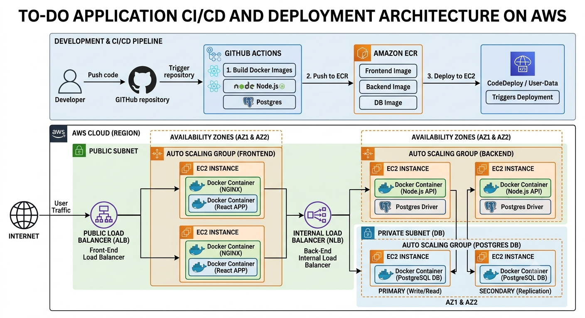
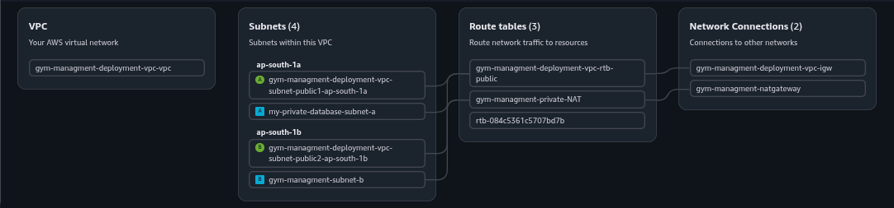
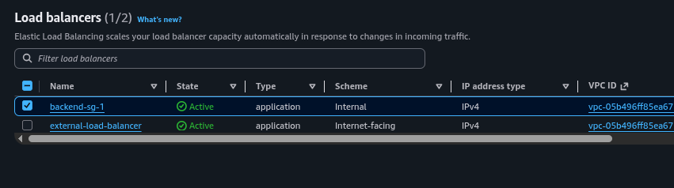
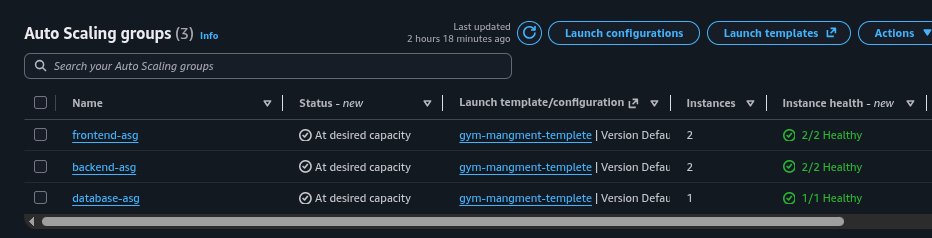
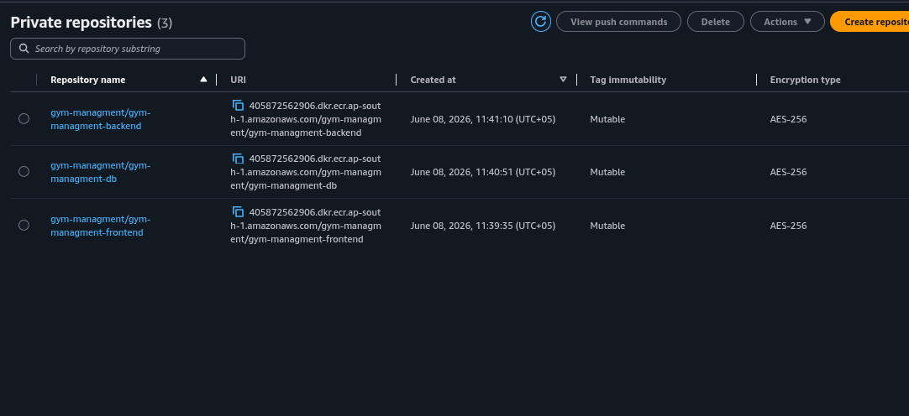
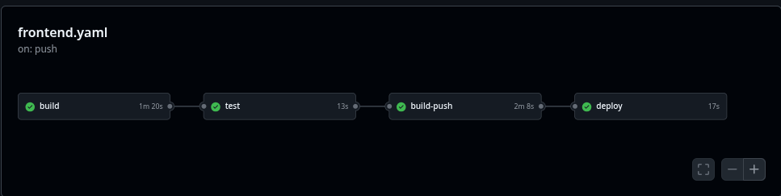
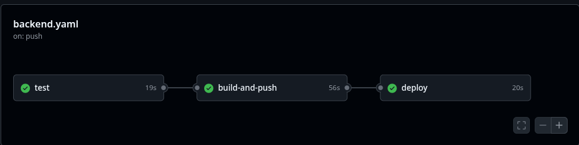
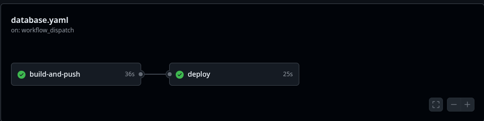

#  Three-Tier Gym Management System — Automated CI/CD & Cloud Deployment on AWS


A production-grade, **three-tier Gym Management System** deployed on **AWS** with a fully automated **CI/CD pipeline** using **GitHub Actions**, **Amazon ECR**, and **CodeDeploy**. The infrastructure is designed for **high availability**, **auto-scaling**, and **fault tolerance** across multiple AWS Availability Zones.


---

##  Overview

This repository contains a **DevOps-driven deployment architecture** for a three-tier Gym Management System. The project is designed for automated delivery, highly available infrastructure, and containerized deployment with AWS ECR and Docker.

- **Frontend**: React + TypeScript (served via NGINX Docker container)
- **Backend**: TypeScript + Express.js (Node.js API Docker container)
- **Database**: PostgreSQL (Primary + Secondary Replica Docker containers)
- **Deployment**: Docker containers deployed on AWS EC2
- **CI/CD**: GitHub Actions pipelines for frontend, backend, and database
- **Container Registry**: AWS ECR (3 separate repositories)
- **Infrastructure**: AWS VPC, Public ALB, Internal NLB, Auto Scaling Groups across AZ1 & AZ2

---

##  Three-Tier Architecture

```
Internet → ALB (Public) → Frontend ASG (AZ1 & AZ2) → NLB (Internal) → Backend ASG (AZ1 & AZ2) → PostgreSQL ASG (Private Subnet)
```

### Tier Breakdown

| Tier | Technology | Docker Containers | Subnet |
|------|-----------|-------------------|--------|
| **Presentation** | React + TypeScript + NGINX | NGINX + React App | Public Subnet |
| **Application** | Node.js + Express.js | Node.js API + PostgreSQL Driver | Public Subnet |
| **Data** | PostgreSQL (Primary + Replica) | PostgreSQL DB (x2) | Private Subnet (DB) |

---

##  Infrastructure Overview

### Key Infrastructure Components

 **AWS VPC:** Network isolation and secure communication



 **Public ALB (Application Load Balancer):**  Receives all user traffic from the internet, routes to Frontend EC2 instances.

 **Internal NLB (Network Load Balancer):**  Internal backend routing from Frontend tier to Backend tier



 **EC2 Auto Scaling Group (Frontend):**  Multiple EC2 instances across AZ1 & AZ2, each running NGINX + React App containers.


 **EC2 Auto Scaling Group (Backend):**  Multiple EC2 instances across AZ1 & AZ2, each running Node.js API + PostgreSQL Driver containers

 **EC2 Auto Scaling Group (PostgreSQL DB):**  Primary (Write/Read) + Secondary (Replication) in Private Subnet across AZ1 & AZ2



 **AWS ECR:** Stores Docker images for all three tiers


  

---

##  CI/CD Pipeline Flow

```
Developer
    │
    ▼ Push Code
GitHub Repository
    │
    ▼ Trigger
GitHub Actions Workflow
    │
    ├─ 1. Build Docker Images
    │      ├── Frontend  (React + NGINX)
    │      ├── Backend   (Node.js API)
    │      └── Database  (PostgreSQL)
    │
    ├─ 2. Push to Amazon ECR
    │      ├── gym-managment/gym-managment-frontend
    │      ├── gym-managment/gym-managment-backend
    │      └── gym-managment/gym-managment-db
    │
    └─ 3. Deploy to EC2
           └── CodeDeploy / User-Data Script → SSH → Pull Image → Restart Container
```

### Frontend Pipeline


**Workflow:**
1. Trigger on push to `main` when `/frontend/**` changes
2. Checkout code
3. Setup Node.js 20
4. Install dependencies
5. Build frontend assets with Vite
6. Upload artifact for validation
7. Authenticate AWS credentials
8. Login to AWS ECR
9. Build Docker image and tag with commit SHA + `latest`
10. Push frontend image to ECR
11. Deploy to EC2 via SSH

### Backend Pipeline


**Workflow:**
1. Trigger on push to `main` when `/backend/**` changes
2. Checkout code
3. Setup Node.js 20
4. Install dependencies
5. Run backend validation/build
6. Authenticate AWS credentials
7. Login to AWS ECR
8. Build Docker image and tag with commit SHA + `latest`
9. Push backend image to ECR
10. SSH into EC2 hosts and deploy the updated container
### Database Pipeline


**Workflow:**
1. Trigger on push to `main` when `/db/**` changes
2. Checkout code
3. Authenticate AWS credentials
4. Login to AWS ECR
5. Build PostgreSQL Docker image
6. Push image to ECR
7. Deploy database container on a self-hosted runner
8. Configure DB environment variables and run the container

---

##  Container Registry (ECR)

Docker images are stored in AWS ECR with separate repositories:

- `gym-managment/gym-managment-frontend` — NGINX + React App image
- `gym-managment/gym-managment-backend` — Node.js API image
- `gym-managment/gym-managment-db` — PostgreSQL image

Images are tagged using **Git commit SHA** + `latest` for easy rollback and version tracking.

---

## ⚙️ Infrastructure Detail

### Two Load Balancers

| Load Balancer | Type | Purpose |
|---------------|------|---------|
| **Public ALB** | Application Load Balancer | Receives internet user traffic → routes to Frontend EC2 instances |
| **Internal NLB** | Network Load Balancer | Internal routing from Frontend tier → Backend EC2 instances |

### Auto Scaling Groups

| ASG | Containers per EC2 | Availability Zones | Subnet |
|-----|-------------------|--------------------|--------|
| **Frontend ASG** | NGINX + React App | AZ1 & AZ2 | Public |
| **Backend ASG** | Node.js API + PostgreSQL Driver | AZ1 & AZ2 | Public |
| **PostgreSQL ASG** | PostgreSQL Primary (AZ1) + Secondary Replica (AZ2) | AZ1 & AZ2 | Private |

### Network Design

- **Public Subnet** — Frontend EC2 instances accessible via ALB
- **Private Subnet (DB)** — PostgreSQL containers have no direct internet access
- **Security Groups** — Restrict traffic: only ALB → Frontend, Frontend → NLB → Backend, Backend → DB

---

##  Tech Stack

### Frontend
- React 18 + TypeScript
- Vite
- Tailwind CSS
- Axios, React Query, React Router, Recharts
- **NGINX** (Docker reverse proxy)

### Backend
- Node.js 20 + Express.js + TypeScript
- Sequelize ORM
- JWT Authentication
- Helmet, CORS, Rate Limiting
- PostgreSQL Driver

### DevOps
- Docker (all three tiers containerized)
- AWS ECR (image registry)
- AWS EC2 (compute — Frontend, Backend, DB)
- AWS ALB (public load balancer)
- AWS NLB (internal load balancer)
- AWS VPC (network isolation)
- Auto Scaling Groups (multi-AZ)
- GitHub Actions (CI/CD pipelines)
- CodeDeploy / EC2 User-Data (deployment trigger)
- SSH deployment scripts

---

## 📁 Project Structure

```
Atomatic-deployment-app/
├── backend/                    # TypeScript backend API
│   ├── Dockerfile
│   ├── package.json
│   ├── src/
│   │   ├── server.ts           # Express server entry point
│   │   ├── config/             # Database configuration
│   │   ├── controllers/        # Route handlers
│   │   ├── middleware/         # Auth, validation, error handling
│   │   ├── models/             # Sequelize models
│   │   ├── routes/             # API routes
│   │   ├── migrations/         # Database migrations
│   │   ├── seeders/            # Demo data
│   │   └── utils/              # JWT, logger, pagination
│   └── tsconfig.json
│
├── frontend/                   # React + TypeScript client
│   ├── Dockerfile
│   ├── nginx.conf              # NGINX configuration
│   ├── package.json
│   └── src/
│       ├── App.tsx
│       ├── main.tsx
│       ├── api/                # API client
│       ├── components/         # React components
│       ├── contexts/           # Auth context
│       ├── pages/              # Page components
│       └── types/              # TypeScript types
│
├── db/                         # PostgreSQL schema and init scripts
│   ├── Dockerfile
│   ├── schema.sql
│   ├── seed.sql
│   └── init.sql
│
└── .github/
    └── workflows/
        ├── backend.yaml        # Backend CI/CD pipeline
        ├── frontend.yaml       # Frontend CI/CD pipeline
        └── database.yaml       # Database CI/CD pipeline
```

---

## 🚀 Local Development

### Backend
```bash
cd backend
npm install
npm run build
npm run migrate
npm run seed
npm run dev
```

### Frontend
```bash
cd frontend
npm install
npm run dev
```

### Database
```bash
cd backend
npm run migrate
npm run seed
```

---

## 🧾 Environment Variables

**Backend `.env`**
```
PORT=5000
DB_HOST=localhost
DB_PORT=5432
DB_NAME=gym_management
DB_USER=postgres
DB_PASSWORD=your_password
JWT_SECRET=your_jwt_secret
NODE_ENV=production
```

**Frontend `.env`**
```
VITE_API_URL=http://localhost:5000/api
```

---

## 🧪 GitHub Actions Secrets Required

Add these secrets to your GitHub repository for CI/CD to work:

```
AWS_ACCESS_KEY_ID          # AWS IAM access key
AWS_ACCESS_KEY             # AWS IAM secret key
AWS_REGION                 # AWS region (e.g., us-east-1)
AWS_ACCOUNT_ID             # AWS account ID

BACKEND_HOST_1             # First backend EC2 instance IP
BACKEND_HOST_2             # Second backend EC2 instance IP
FRONTEND_HOST_1            # First frontend EC2 instance IP
FRONTEND_HOST_2            # Second frontend EC2 instance IP

SSH_KEY                    # Private SSH key for EC2 access
USERNAME                   # EC2 instance username (ubuntu)
PORT                       # SSH port (22)

DB_HOST                    # Database host
DB_PORT                    # Database port (5432)
POSTGRES_NAME              # Database name
POSTGRES_USER              # Database user
POSTGRES_PASSWORD          # Database password
```

---

## 🔐 Security Features

- ✅ **JWT Authentication** — Secure token-based authentication
- ✅ **Password Hashing** — bcryptjs with cost factor 12
- ✅ **Rate Limiting** — 200 req/15min (general), 20 req/15min (auth)
- ✅ **Helmet.js** — HTTP security headers
- ✅ **CORS Protection** — Cross-origin resource sharing configuration
- ✅ **Input Validation** — Express-validator middleware
- ✅ **Private Subnet DB** — PostgreSQL not accessible from internet
- ✅ **Security Groups** — Strict inter-tier traffic control
- ✅ **IAM Roles** — EC2-to-ECR access without hardcoded credentials
- ✅ **Error Handling** — Centralized error management
- ✅ **Request Logging** — Morgan + Winston logging

---

## 📊 API Endpoints

### Authentication
- `POST /api/auth/login` — User login
- `POST /api/auth/register` — User registration
- `POST /api/auth/logout` — User logout

### Members
- `GET /api/members` — List all members
- `POST /api/members` — Create member
- `GET /api/members/:id` — Get member details
- `PUT /api/members/:id` — Update member
- `DELETE /api/members/:id` — Delete member

### Trainers
- `GET /api/trainers` — List all trainers
- `POST /api/trainers` — Create trainer
- `GET /api/trainers/:id` — Get trainer details
- `PUT /api/trainers/:id` — Update trainer
- `DELETE /api/trainers/:id` — Delete trainer

### Payments
- `GET /api/payments` — List payments
- `POST /api/payments` — Create payment
- `GET /api/payments/:id` — Get payment details
- `PUT /api/payments/:id` — Update payment status

### Attendance
- `GET /api/attendance` — List attendance records
- `POST /api/attendance/check-in` — Member check-in
- `POST /api/attendance/check-out` — Member check-out

### Dashboard
- `GET /api/dashboard/stats` — Dashboard statistics
- `GET /api/dashboard/revenue` — Revenue analytics
- `GET /api/dashboard/attendance` — Attendance analytics

---

## 🔧 Available Scripts

### Frontend
```bash
npm run dev      # Start development server
npm run build    # Build for production
npm run preview  # Preview production build
npm run lint     # Run ESLint
npm run test     # Run tests
```
### Backend
```bash
npm run dev          # Start development server
npm run build        # Compile TypeScript
npm run start        # Start production server
npm run migrate      # Run database migrations
npm run seed         # Seed demo data
npm run migrate:undo # Rollback migrations
```


---

### Push to AWS ECR

```bash
# Configure AWS
aws configure
```
## Login to ECR
```bash
aws ecr get-login-password --region us-east-1 | docker login --username AWS --password-stdin YOUR_ACCOUNT_ID.dkr.ecr.us-east-1.amazonaws.com
```
## Tag and push
```bash
docker tag gym-backend:latest YOUR_ACCOUNT_ID.dkr.ecr.us-east-1.amazonaws.com/gym-managment/gym-managment-backend:latest
docker push YOUR_ACCOUNT_ID.dkr.ecr.us-east-1.amazonaws.com/gym-managment/gym-managment-backend:latest
```

---

## 📈 Performance & Scalability

- **Horizontal Scaling** — AWS Auto Scaling Groups for automatic instance scaling
- **Dual Load Balancing** — ALB for public frontend traffic, NLB for internal backend routing
- **Multi-AZ Deployment** — Frontend, Backend, and DB ASGs span AZ1 & AZ2
- **PostgreSQL Replication** — Secondary replica for read offloading and failover
- **Caching** — Response compression with gzip
- **API Rate Limiting** — Prevents abuse and DDoS attacks
- **Stateless Architecture** — Enables easy container scaling

---

##  Troubleshooting

### Backend Issues
- **Port already in use** — Change PORT in `.env`
- **Database connection failed** — Check `DB_HOST`, `DB_USER`, `DB_PASSWORD` in `.env`
- **JWT errors** — Ensure `JWT_SECRET` is set

### Frontend Issues
- **API connection failed** — Check `VITE_API_URL` environment variable
- **Build errors** — Clear `node_modules` and reinstall: `npm install`

### Docker Issues
- **Permission denied** — Add user to docker group: `sudo usermod -aG docker $USER`
- **Image not found** — Build image first: `docker build -t image-name .`

### EC2 Deployment Issues
- **SSH connection refused** — Check security group rules allow port 22
- **Docker pull fails** — Verify ECR credentials and image repository name

---

## 🎥 Live Testing Demo

[](./live-testing.mp4)

---


*Last Updated: June 2026*
